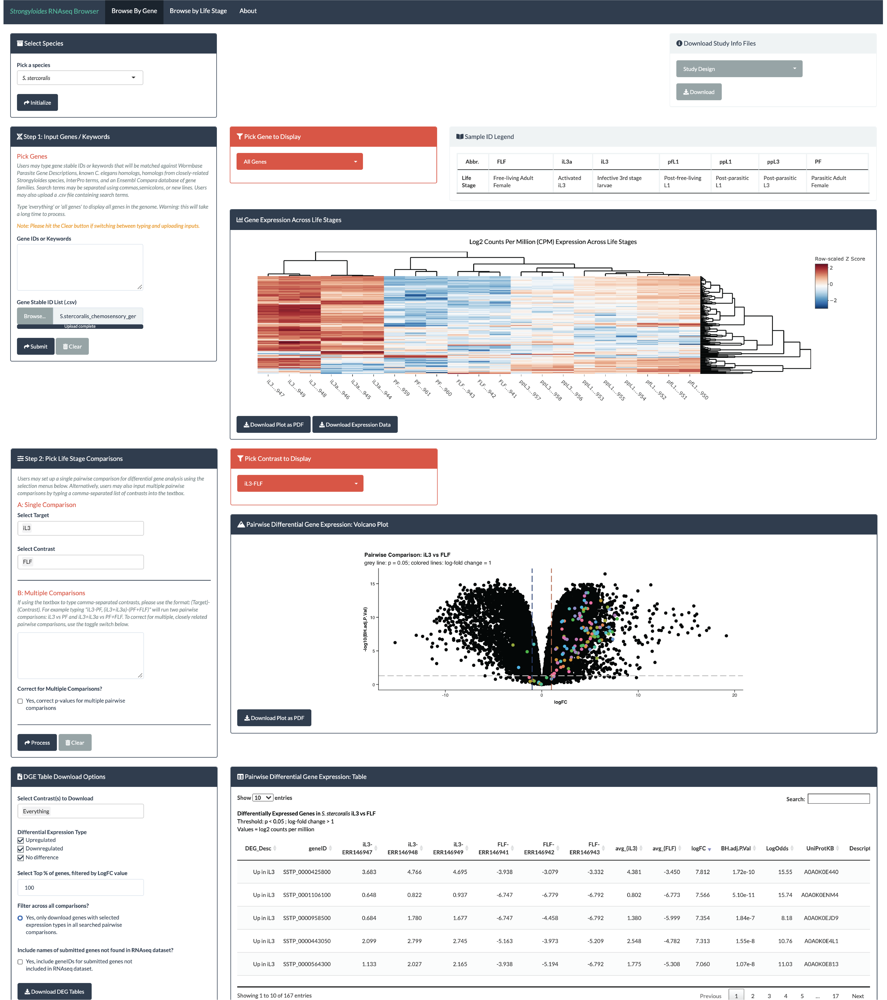

# Strongyloides_RNAseq_Browser 
Web-based Shiny App for browsing and on-demand analysis of *Strongyloides spp* RNA-seq datasets 

## Table of Contents  
1. [General Information](#general-information)
2. [App Setup & Deployment](#app-setup-&-deployment)
3. [App Features](#app-features)
4. [Examples of App Use](#examples-of-shiny-app-ui)
5. [Sources](#sources)
6. [License](#license)
7. [Authors](#authors)

## General Information
This repository contains source code for the web-based *Strongyloides* RNA-seq Browser. This app is deployed via Shinyapps.io but can also be run locally. See App Setup and App Features sections below for additional details.  
The sections below describe the contents of the primary subfolders within this repository.

### Data  
This folder contains pre-processed data files, including study design files, gene annotations, and digital gene expression lists (vDGEList) containing variance-stabilized, filtered, TMM-normalized RNA-seq data.

### Server
Server files for the Shiny app.

### UI
User interface files for the Shiny app. Includes custom css and additional README files with methods details.

### www
Static files that can be interactively downloaded within the *Strongyloides* RNA-seq Browser environment.

## App Setup & Deployment
To access a stable deployment of the *Strongyloides* RNA-seq Browser Web App, please visit:   [asbryant.shinyapps.io/strongyloides_rnaseq_browser/](asbryant.shinyapps.io/strongyloides_rnaseq_browser/)  

To run the latest version locally from GitHub, use the following command in R/RStudio:  
`library(shiny)`  
`shiny::runGitHub(repo = 'Strongyloides_RNAseq_Browser', username = 'HallemLab')`  

To run a specific release locally use the following commands in R/RStudio:  
  * For PCs --  
    `library(shiny)`  
    `shiny::runUrl('https://github.com/HallemLab/Strongyloides_RNAseq_Browser/archive/<RELEASE_VERSION>.zip') ` 

  * For Macs --  
    `library(shiny)`  
    `shiny::runUrl('https://github.com/HallemLab/Strongyloides_RNAseq_Browser/archive/<RELEASE_VERSION>.tar.gz')`  

Please note: the download step for runURL/runGitHub takes a substantial amount of time. We recommend downloading this archive and running the application locally. 

## App Features  
The *Strongyloides* RNA-seq Shiny App enables users to browse publically available *Strongyloides* bulk RNA-seq datasets and perform on-demand analyses including differential expression and gene set enrichment. Data from the following species are currently included: *S. stercoralis*, *S. ratti*, *S. papillosus*, and *S. venezuelensis*. The app permits browsing RNA-seq data in two modes:

  1. Browse by Life Stage Mode
  2. Browse by Gene Mode  
  
Features of the app include:  

* Search for gene(s) of interest using stable geneIDs or keywords
* Extract gene expression values for genes of interest
  - Display gene expresion across life stages as a heatmap (all genes of interest) or a boxplot (individual genes)
  - Download log2 counts-per-million expression for genes of interest as .xslx
* On demand limma-voom-based pairwise differential gene expression analysis
  - Display results as interactive volcano plots and datatables
  - Download results as .pdf (plots) or .xlsx (datatables)
* Gene set enrichment analysis using the clusterProfiler R package and an Ensembl Compara protein family set established by Hunt *et al* 2016. (Browse By Life Stage Mode)
  - Display results as bubble plot and interactive datatable
  - Download results as .pdf (plots) or .xlsx (datatables)
* Download raw/pre-processed data using user-friendly dropdown menu
  - Study design files (.csv)
  - Log2 counts-per-million expression for all genes and all samples (.csv)
  - Variance-stabilized DGEList object (R object; primary data input for the app)
  - Raw expression data for genes discarded during low-count filterering; see Pre-processing files for more information (.csv)

## Examples of Shiny App UI

## Sources
* [Shiny](https://shiny.rstudio.com/) - UI framework
* [kallisto](https://pachterlab.github.io/kallisto/) - Lightweight RNA-seq pseudoalignment method
* [limma](https://bioconductor.org/packages/release/bioc/html/limma.html) - Diferential gene expression
* [clusterProfiler](https://bioconductor.org/packages/release/bioc/html/clusterProfiler.html) - Gene set enrichment analysis
* *Strongyloides* RNA-seq datasets:
  - [Stolzfus *et al* 2012](https://journals.plos.org/plosntds/article?id=10.1371/journal.pntd.0001854)
  - [Hunt *et al* 2016](https://www.nature.com/articles/ng.3495)
  - [Hunt *et al* 2018](https://www.nature.com/articles/s41598-018-23514-z)
* [WormBase ParaSite](https://parasite.wormbase.org/index.html) - Gene annotations and reference transcriptomes
* [DIYTranscriptomics](http://diytranscriptomics.com/) - Virtual asynchronous course where the authors learned best practices for RNA-seq data analysis; provided primary pipeline for data pre-processing and analysis

## License  
This project is licensed under the MIT License. 

## Authors  
* [Astra Bryant, PhD](https://github.com/astrasb)
* [Stephanie DeMarco, PhD](https://github.com/sfdemarco)
* [Elissa Hallem, PhD](https://github.com/ehallem)
